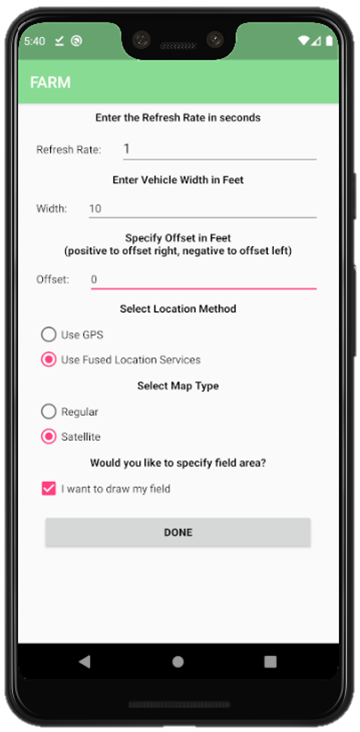
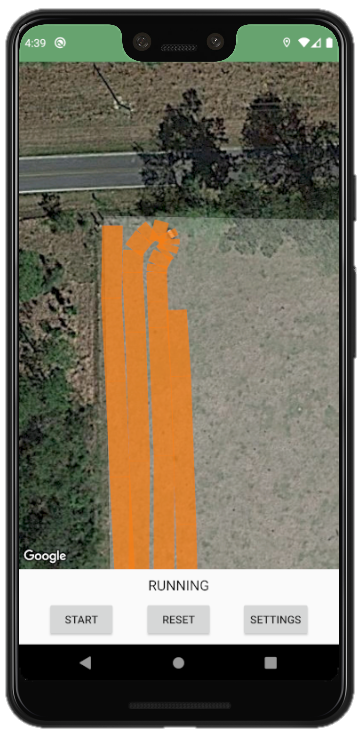

# FARM
The Field Augmented Routing Module (FARM) allows users to track their location history while moving around a field. This helps to ensure that a field is properly and efficiently covered during fertilization, planting, etc.

## Current functionality
* Tracks user's path as they move. Path is plotted as a semi-transparent rectangluar polygon. Loction tracking can be paused and restarted.
* User can define the width of the rectangle in feet so that the width of the sprayer, planter, implement, etc. is represented by the plotted path.
* User can define the boundaries of their field by tapping locations along the perimeter of their field on the map (optional). This area is then highlighted on the main map.
* Location method can be chosen as:
    * GPS (uses only GPS satellite signals)
    * Fused Location (uses a combination of GPS, cell tower, and Wi-Fi signals)
* Location refresh rate can be chosen.
## Screenshots
Settings            | Drawing Field     | Field Plotted     | Plotting Path     |
:------------------:|:-----------------:|:-----------------:|:------------------:
 |  |  | 
## TODO
* Track stats such as acreage covered, total acreage of define field.
* Give user ability to save defined field for later use.
* Give user to save progress so they can resume later.
* Track time spent working.
## Dependencies
* The app is dependent on the android-maps-utils library
* Link to documentation: 
    * https://developers.google.com/maps/documentation/android-sdk/utility/setup
    * https://github.com/googlemaps/android-maps-utils
* To import this library, use the 3rd set of instructions given at https://o7planning.org/en/10525/how-to-add-external-libraries-to-android-project-in-android-studio
